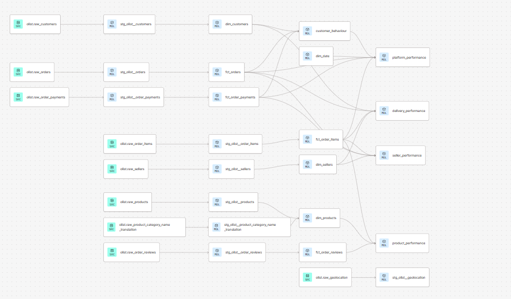

# **Olist Analytics Engineering Project**


## Project Overview
This project demonstrates an end-to-end ELT analytics engineering pipeline built on the [Olist Brazilian E-Commerce Dataset](https://www.kaggle.com/datasets/olistbr/brazilian-ecommerce), which contains approximately 100,000 orders placed across Brazilian marketplaces between 2016 and 2018.

Raw data is extracted and loaded into BigQuery using a Python ingestion script with simulated incremental loading, then transformed and modelled with dbt into a tested, documented dimensional model. The project includes 9 staging models, a dimensional core layer, and 5 analytical marts, supported by automated data quality tests, full column-level documentation, and data lineage tracking.

This ELT approach contrasts with traditional ETL by loading raw data directly into the warehouse and performing all transformation in-warehouse using SQL, keeping the raw layer untouched and all business logic centralised in dbt.

## Architecture

The pipeline follows a layered ELT architecture. Raw CSV data is loaded into BigQuery, then transformed through staging, dimensional, and analytical layers using dbt.  
Each staging model applies deduplication, type casting, and column standardisation, ensuring downstream models build on clean, reliable data. Business logic is deliberately kept out of the core layer and concentrated in the analytical marts.



- **Sources** — raw tables loaded from CSV into BigQuery
- **Staging** — cleaned and standardised, one model per source
- **Core** — dimension and fact tables forming the dimensional model
- **Marts** — analytical models answering specific business questions

## Tech Stack

- **Python** — data extraction and loading into BigQuery
- **Google BigQuery** — cloud data warehouse
- **dbt (Data Build Tool)** — transformation, testing, and documentation
- **GitHub** — version control
- **SQL** — transformation logic across all dbt models

## Setup & Usage

This project runs on the author's own BigQuery and dbt Cloud environment, which is not publicly accessible. To run it yourself, you would set up your own environment following these steps:

**1. Prerequisites**
- A Google Cloud project with BigQuery enabled
- A dbt Cloud account (or dbt Core installed locally)
- Python 3.8+ with the `google-cloud-bigquery`, `pandas`, and `python-dotenv` packages

**2. Get the data**
Download the [Olist dataset](https://www.kaggle.com/datasets/olistbr/brazilian-ecommerce) and place the nine CSV files in a `data/raw/` folder.

**3. Configure credentials**
Create a BigQuery service account, download the JSON key, and reference it in a `.env` file (see `.gitignore` — credentials are never committed).

**4. Load the raw data**
Run the extraction script to load the CSVs into BigQuery. The `--limit` flag controls what proportion of rows to load, simulating incremental loading:

```
python extraction/extraction.py --limit 0.5   # initial load (first 50%)
python extraction/extraction.py --limit 1.0   # incremental load (remaining rows)
```
**5. Build the models**
Point dbt at your BigQuery project and run:
```
dbt build
```
This builds all staging, dimensional, and mart models and runs the full test suite.

## Project Structure

```
olist-dbt-analytics/
├── extraction/
│   └── extraction.py
├── models/
│   ├── staging/
│   ├── marts/
│   │   ├── core/
│   │   └── analytics/
├── tests/
│   └── generic/
├── macros/
├── images/
├── dbt_project.yml
├── packages.yml
├── README.md
├── ANALYSIS.md
└── DECISIONS.md
```

## Testing

Data quality is enforced throughout the pipeline using dbt's testing framework. The project includes over 120 tests covering primary key uniqueness, non-null constraints, referential integrity between models, accepted values, and data types.

Alongside dbt's built-in tests, two custom generic tests were written:

- **`data_type`** — asserts that a column is stored as the expected data type by querying BigQuery's `INFORMATION_SCHEMA`, catching cases where source data is loaded with an incorrect type.
- **`not_negative`** — asserts that numeric columns such as prices, payments, and revenue never contain negative values.

Singular tests are also used for specific business rules, such as asserting that payment values are never negative. All tests run automatically as part of `dbt build`, ensuring data integrity is validated on every run.

## Business Analysis

A full analysis of the modelled data is available in [ANALYSIS.md](ANALYSIS.md), covering three key findings with actionable recommendations:

- **Late delivery severely damages customer satisfaction:**  review scores collapse from 4.29 to below 1.7 once orders arrive late, with delays originating almost entirely at the carrier stage and concentrated in Brazil's Northeast.
- **Revenue is highly concentrated:**  the top 10% of sellers generate two-thirds of all platform revenue.
- **Category performance varies:**  high-value, well-reviewed categories like musical instruments and small appliances offer the strongest returns for marketing and seller recruitment.

## Key Decisions & Limitations

Key architectural decisions and their reasoning are documented in [DECISIONS.md](DECISIONS.md).

The main limitations of this project are:

- **Incremental loading is simulated** — as the Olist dataset is static, incremental loading is demonstrated by splitting the load into batches via a `--limit` flag. In production this would use a timestamp watermark against a live source.
- **Date dimension bounds are hardcoded** — `dim_date` covers 2015–2019 to fully span the dataset. In production this would be derived dynamically.
- **Two product categories lack English translations** — `pc_gamer` and `portateis_cozinha_e_preparadores_de_alimentos` are missing from the source translation table; the related test is set to `warn` rather than `error`.
- **Geolocation is staged but not used in marts** — customer and seller location (city/state) is already available in their respective tables, so geolocation coordinates were intentionally not carried downstream.

## Author
**Mark Smolders**  
[LinkedIn](https://www.linkedin.com/in/mark-smolders-231077159/) | [GitHub](https://github.com/MarkSmolders)